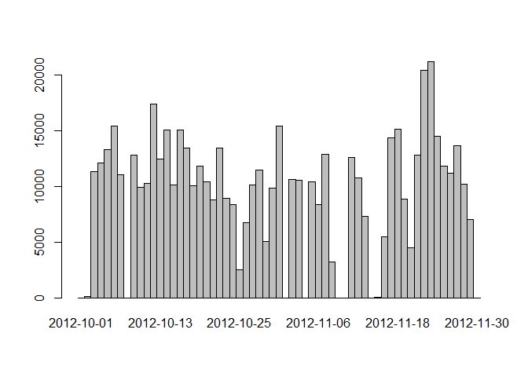
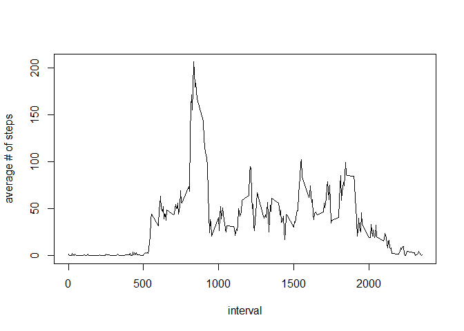
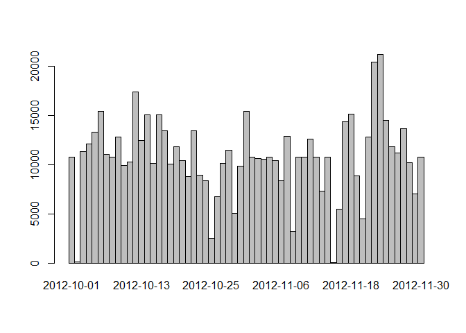
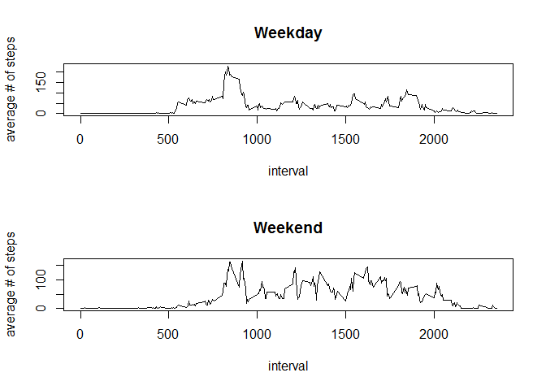

# Reproducible Research: Peer Assessment 1


## Loading and preprocessing the data
1. Loading the data

```r
data <- read.csv("activity\\activity.csv")
```
2. Transform date variable to POSIXct (load lubridate package before)

```r
library(lubridate)
data$date <- ymd(data$date)
```

## What is mean total number of steps taken per day?
1. A histogram of the total number of steps taken each day

```r
sumStepsEachDay <- tapply(data$steps, data$date, sum, na.rm = TRUE)
barplot(sumStepsEachDay, space = 0)
```

 

2. Calculation about the total number of steps taken per day.

```r
meanStepsperDay <- mean(sumStepsEachDay)
medianStepsperDay <- median(sumStepsEachDay)
```

The mean and median total number of steps taken per day are 10395 and 9354.2295082, respectively.

## What is the average daily activity pattern?

1. First average above all days for each interval. Then use interval for the factor variable in tapply.

```r
meanStepsEachInterval <- tapply(data$steps, data$interval, mean, na.rm = TRUE)
plot(as.integer(names(meanStepsEachInterval)), 
     meanStepsEachInterval, 
     type = "l", xlab = "interval", ylab=("average # of steps"))
```

 

```r
maxInterval <- meanStepsEachInterval[which(meanStepsEachInterval == max(meanStepsEachInterval, na.rm = TRUE))]
```

2. The 5-minute interval 835 contains the maximum number of steps with an average of 206.1698113 steps.

## Imputing missing values
1. Total number of missing values is 2304.

2+3. Use the mean for the 5-min interval to fill the missing values and create a new dataset with it

```r
dataNew <- data
subset <- is.na(dataNew$steps)
dataNew$steps[subset] <- meanStepsEachInterval[as.character(dataNew$interval[subset])]
```

4. A histogram of the total number of steps taken each day

```r
sumStepsEachDayNew <- tapply(dataNew$steps, dataNew$date, sum, na.rm = TRUE)
barplot(sumStepsEachDayNew, space = 0)
```

 


```r
meanStepsperDayNew <- mean(sumStepsEachDayNew)
medianStepsperDayNew <- median(sumStepsEachDayNew)
```
The mean and median total number of steps taken per day are 1.0766189\times 10^{4} and 1.0766189\times 10^{4}, respectively.
These values differ from the unimputed dataset by 371.1886792 and 1411.959171, respectively.

## Are there differences in activity patterns between weekdays and weekends?
1. A new variable indicating whether the observation belongs to a weekday or weekend.

```r
dataNew$PartofWeek <- as.factor(ifelse(weekdays(dataNew$date) %in% c("Saturday","Sunday") ,"weekend","weekday"))
```

2. Panel plot containing a time series plot of the 5-minute interval (x-axis) and the average number of steps taken, averaged across all weekday days or weekend days (y-axis).


```r
par(mfcol=c(2,1))
meanStepsEachIntervalWeekday <- 
        tapply(dataNew$steps[dataNew$PartofWeek == "weekday"], 
               data$interval[dataNew$PartofWeek == "weekday"], 
               mean, na.rm = TRUE)

meanStepsEachIntervalWeekend <- 
        tapply(dataNew$steps[dataNew$PartofWeek == "weekend"], 
               data$interval[dataNew$PartofWeek == "weekend"], 
               mean, na.rm = TRUE)

plot(as.integer(names(meanStepsEachIntervalWeekday)), 
     meanStepsEachIntervalWeekday, 
     type = "l", xlab = "interval", ylab=("average # of steps"), main = "Weekday")

plot(as.integer(names(meanStepsEachIntervalWeekend)), 
     meanStepsEachIntervalWeekend, 
     type = "l", xlab = "interval", ylab=("average # of steps"), main = "Weekend")
```

 

